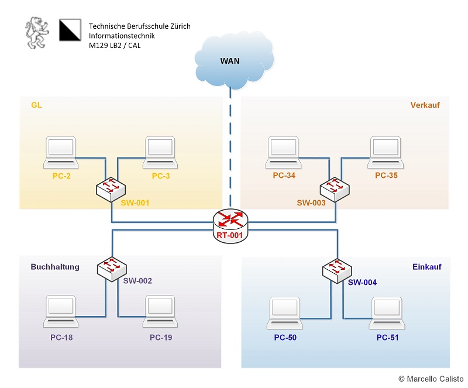
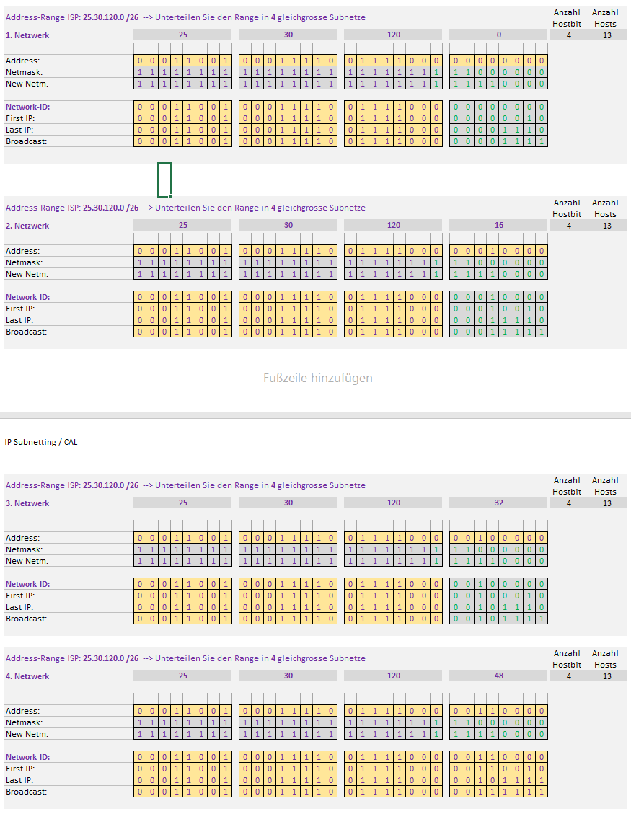

# N1 Auftrag 3

## Forderung

Ein Netzwerk mit;

8 Computer
4 Switches
1 Router

## Bedingungen:

Vom ISP erhalten sie den IP-Range: 25.30.120.0/26

Erstellen Sie vier gleichgrosse Subnetze - für jede Abteilung eines.

## Netzplan 

## Aufträge

### Excel Netzwerk Tabelle

### Was ich tat

Ich verwendete eine 28er Netzmaske so dass ich mein Netzwerk in 4 Subnetze aufteilen konnte.  

Die Konfiguration machte ich so, wie sie in meiner Netzwerktabelle steht. 

Die IPs setzte ich so, dass sie zu den Gerätenamen passen.

### Subnetze

Subnetz: 25.30.120.0/28 (IP-Range: 25.30.120.0 - 25.30.120.15)
Subnetz: 25.30.120.16/28 (IP-Range: 25.30.120.16 - 25.30.120.31)
Subnetz: 25.30.120.32/28 (IP-Range: 25.30.120.32 - 25.30.120.47)
Subnetz: 25.30.120.48/28 (IP-Range: 25.30.120.48 - 25.30.120.63)

###