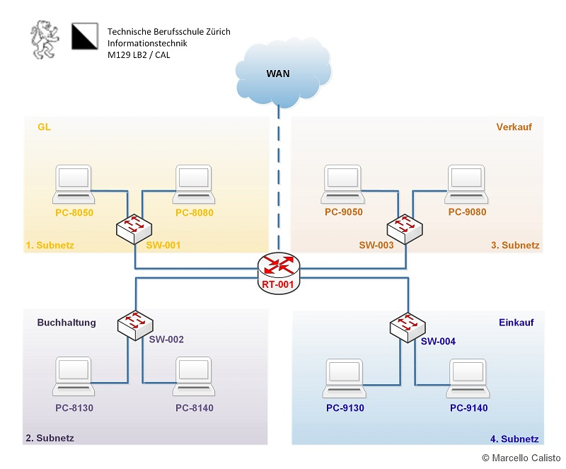
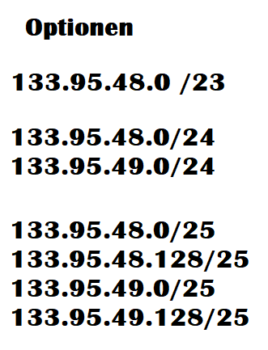
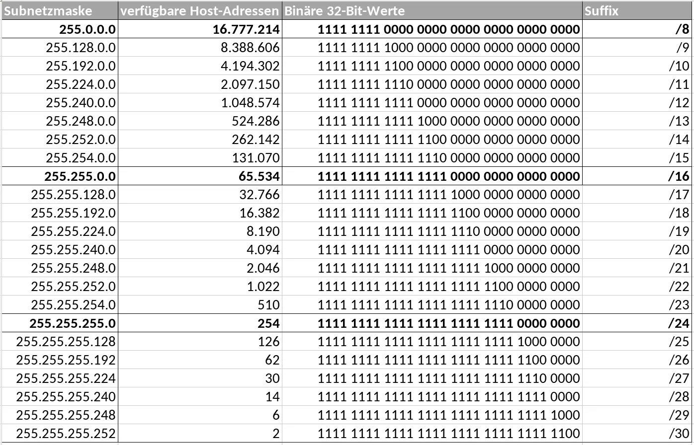
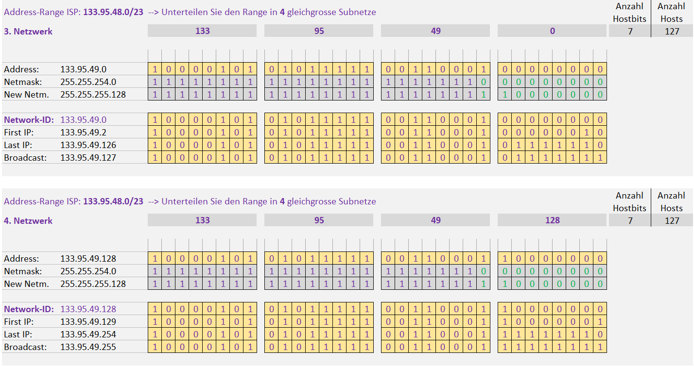

# N2 Auftrag 1

## Forderung

Netzwerk aufsetzen

8 Computer
4 Switches
1 Router

## Bedingungen:

Netzwerk läuft und ist gut dokumentiert.

## Netzplan 

## Aufträge

Ich muss das Netzwerk 133.95.48.0 /23 auf vier andere Netze aufteilen.

Bei diesem Netzwerk würde dies mit einer /24er Netzmaske noch nicht gehen, da ich dann nur zwei Subnetze erstellen kann. Also entschied ich mich für ein /25er Netzwerk, so habe ich in jedem Subnetz 128 IP Adressen.

Diese Subnetztabelle half mir dabei. 

### Excel Netzwerk Tabelle ausfüllen

### Subnetzte

Subnetz 1: 133.95.48.0/25
PC-8050 (133.95.48.50)
PC-8080 (133.95.48.80)
Default Gateway: 133.95.48.1
Freie IPs: 124
Genutzte IPs: 2

Subnetz 2: 133.95.48.128/25
PC-8130 (133.95.48.130)
PC-8140 (133.95.48.140)
Default Gateway: 133.95.48.129
Freie IPs: 124
Genutzte IPs: 2

Subnetz 3: 133.95.49.0/25
PC-9050 (133.95.49.50)
PC-9080 (133.95.49.80)
Default Gateway: 133.95.49.1
Freie IPs: 124
Genutzte IPs: 2

Subnetz 4: 133.95.49.128/25
PC-9130 (133.95.49.130)
PC-9140 (133.95.49.140)
Default Gateway: 133.95.49.129
Freie IPs: 124
Genutzte IPs: 2

/25 = 255.255.255.128

### Tests

Ping Funktioniert

### Fragen

Wieviele freie IP-Adressen gibt es in der Abteilung Einkauf?
124

Ist ein mögliches Wachstum der Firma berücksichtigt?
Ja, jedes Netzwerk hat 124 freie IPs

Ist das Netzwerk-Design sinnvoll?
Ja

Gibt es Verbesserungsvorschläge bzgl. Netzwerk-Design?

Nein

Welche zusätzlichen Informationen wären nützlich, um für dieses Netzwerk-Design einen Optimierungsvorschlag auszuarbeiten?

keine