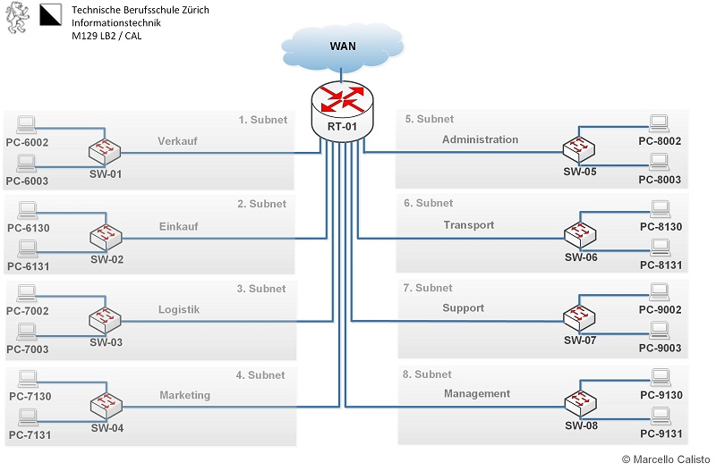
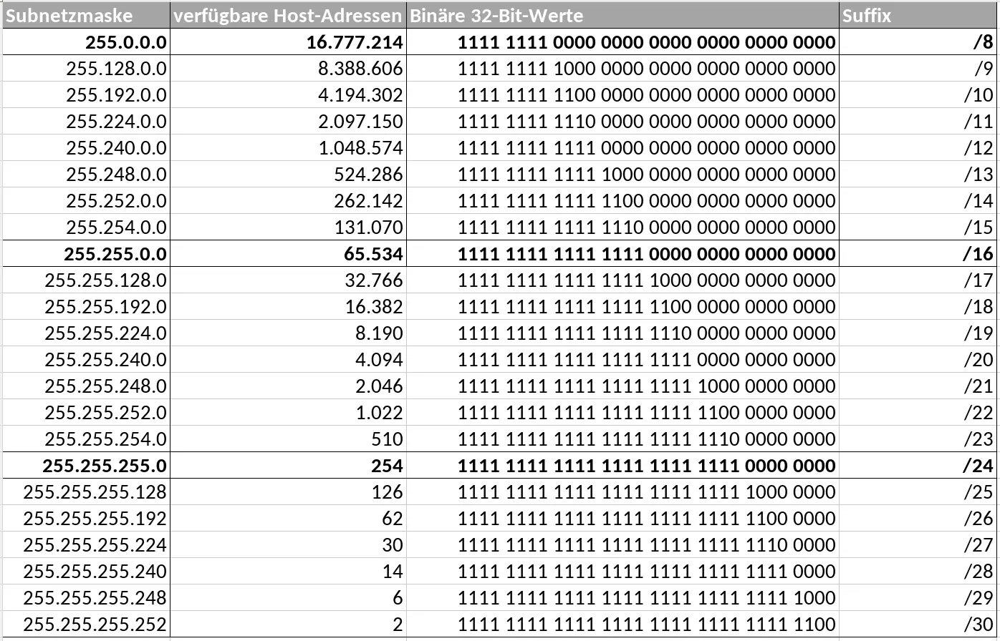
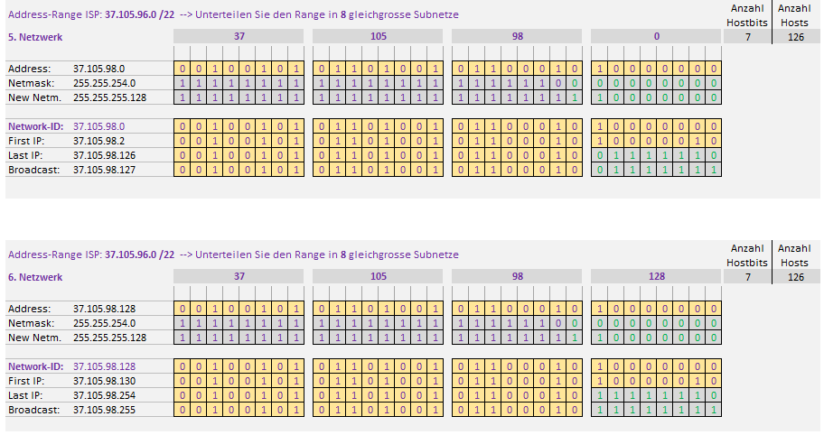

# N2 Auftrag 2

## Forderung

Netzwerk aufsetzen

16 Computer
8 Switches
1 Router

## Bedingungen:

Netzwerk läuft und ist gut dokumentiert.

## Netzplan 

## Aufträge

Ich muss das Netzwerk 37.105.96.0/22 auf acht andere Netze aufteilen.

Bei einem Netzwerk mit /22er Netzmaske würde dies noch nicht gehen, da ich dort nur zwei erstellen kann. Also entschied ich mich für ein /25er Netzwerk, so habe ich in jedem Subnetz 128 IP Adressen.

Diese Subnetztabelle half mir dabei. 

### Excel Netzwerk Tabelle ausfüllen

### Subnetzte

Subnetz 1: 37.105.96.0/25
PC-6002: 37.105.96.2
PC-2003: 37.105.96.3
Default Gateway: 37.105.96.1

Subnetz 2: 37.105.96.128/25
PC-6130: 37.105.96.130
PC-6131: 37.105.96.131
Default Gateway: 37.105.96.129

Subnetz 3: 37.105.97.0/25
PC-7002: 37.105.97.2
PC-7003: 37.105.97.3
Default Gateway: 37.105.97.1

Subnetz 4: 37.105.97.128/25
PC-7130: 37.105.97.130
PC-7131: 37.105.97.131
Default Gateway: 37.105.97.129

Subnetz 5: 37.105.98.0/25
PC-8002: 37.105.98.2
PC-8003: 37.105.98.3
Default Gateway: 37.105.98.1

Subnetz 6: 37.105.98.128/25
PC-8130: 37.105.98.130
PC-8131: 37.105.98.131
Default Gateway: 37.105.98.129

Subnetz 7: 37.105.99.0/25
PC-9002: 37.105.99.2
PC-9003: 37.105.99.3
Default Gateway: 37.105.99.1

Subnetz 8: 37.105.99.128/25
PC-9130: 37.105.99.130
PC-9131: 37.105.99.131
Default Gateway: 37.105.99.129

/25 = 255.255.255.128

### Fragen

Wieviele freie IP-Adressen gibt es in der Abteilung Marketing?

126

Eine neue Mitarbeiterin wird in der Abteilung Marketing eingestellt. Welche Netzwerkkonfiguration erhält sie?

PC7132 - IP: 37.105.97.132

Ist das Netzwerk-Design sinnvoll?

Nein, nur 2 PCs an je einem Switch bei 16 PC macht keinen Sinn.

Gibt es Verbesserungsvorschläge bzgl. Netzwerk-Design?

Ja, mehr PCs oder weniger Switches.

Welche zusätzlichen Informationen wären nützlich, um für dieses Netzwerk-Design einen Optimierungsvorschlag auszuarbeiten?

Kosten

### Quellen
Subnetztabelle
 [**ScaleUpTech**](https://www.google.com/url?sa=i&url=https%3A%2F%2Fwww.scaleuptech.com%2Fblog%2Fwas-ist-und-wie-funktioniert-subnetting%2F&psig=AOvVaw2Kq-971-D4MhHarboRuGbM&ust=1705600037034000&source=images&cd=vfe&opi=89978449&ved=0CBQQjhxqFwoTCIi2qrT95IMDFQAAAAAdAAAAABAD)

Fragen und Antworten
[**ChatGPT**](https://chat.openai.com)