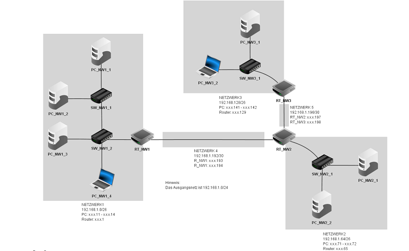

# Fehlersuche im Netzwerk (mit Filius)

## Aufgabenstellung 3.1

## Situation

Sie erhalten mehrere virtuelle Netzwerke als Filiusdateien. In den Netzwerken ist jeweils ein Fehler vorhanden.  
Das Netzwerklayout ist für alle Aufgaben identisch:

## Auftrag

-   Sie gehen strukturiert vor um die **Fehler zu finden** und zu
    **korrigieren**.
-   Ihre ausgeführten Schritte für die **Fehlersuche** halten Sie in Ihrer **Dokumentation** fest.
-   Zusätzlich halten Sie die **gefundenen Fehler und deren Behebung** in der separaten Tabelle fest.
- Nachdem Sie sämtliche Fehler gefunden haben, testen Sie Ihr Lösungsfile mit dem Coach/Lehrer (Live-Demo)

 

## Files für das Troubleshooting

1. [Netzwerk-Fehler-1](Netzwerk-Fehler-1.fls)
2. [Netzwerk-Fehler-2](Netzwerk-Fehler-2.fls)
3. [Netzwerk-Fehler-3](Netzwerk-Fehler-3.fls)
4. [Netzwerk-Fehler-4](Netzwerk-Fehler-4.fls)

## Fehlerdokumentation

**Fehlersuche Journal**

| **Auftrag** | **Ausgeführter Test** | **Beobachtetes Resultat/Ausgeführte Korrektur** |
|-----------|------------|----------|
| Netzwerk-Fehler-1.fls | PC Konfigurationen angeschaut | Gateway bei PCs in Netzwerk 4 nicht gesetzt -> gesetzt auf 192.168.4.1  |
| Netzwerk-Fehler-1.fls | NB-4-2 kommt nicht an 15.2.1.20 | Weiterleitungstabelleneintrag ergänzt  |
| Netzwerk-Fehler-2.fls | Ping von allen in alle Netzwerke | Schnittstellen getauscht und unnötige Schnittstelle gelöscht |       
| Netzwerk-Fehler-3.fls | Ping von NB-2-1 geht nicht weiter als RT-3 | Standartgateway von RT-3 ist auf 192.168.2.1 gesetzt. Geändert auf 10.1.0.2|
| Netzwerk-Fehler-3.fls | Ping von NB-3-1 geht nicht an 15.2.1.9 | Falsche Einträge in Weiterleitungstabelle -> geändert |
| Netzwerk-Fehler-4.fls | Netzwerk angeschaut | RT-3 wurde mit Switch ausgetauscht -> Neuen Router konfiguriert  |    
       

### Quellen
Fragen und Antworten
-> [**ChatGPT**](https://chat.openai.com)