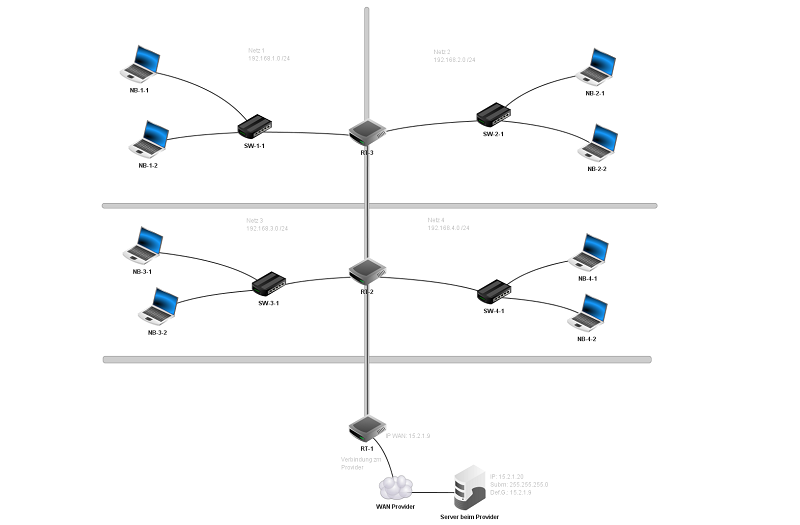

# Fehlersuche im Netzwerk (mit Filius)

## Aufgabenstellung 3.1

## Situation

Sie erhalten mehrere virtuelle Netzwerke als Filiusdateien. In den Netzwerken ist jeweils ein Fehler vorhanden.  
Das Netzwerklayout ist für alle Aufgaben identisch:

## Auftrag

-   Sie gehen strukturiert vor um die **Fehler zu finden** und zu
    **korrigieren**.
-   Ihre ausgeführten Schritte für die **Fehlersuche** halten Sie in Ihrer **Dokumentation** fest.
-   Zusätzlich halten Sie die **gefundenen Fehler und deren Behebung** in der separaten Tabelle fest.
- Nachdem Sie sämtliche Fehler gefunden haben, testen Sie Ihr Lösungsfile mit dem Coach/Lehrer (Live-Demo)

 

## Files für das Troubleshooting

1. [Netzwerk-Fehler-1](Netzwerk-Fehler-1.fls)
2. [Netzwerk-Fehler-2](Netzwerk-Fehler-2.fls)
3. [Netzwerk-Fehler-3](Netzwerk-Fehler-3.fls)
4. [Netzwerk-Fehler-4](Netzwerk-Fehler-4.fls)
5. [Netzwerk-Fehler-5](Netzwerk-Fehler-5.fls)

## Fehlerdokumentation

**Fehlersuche Journal**

| **Auftrag** | **Ausgeführter Test** | **Beobachtetes Resultat/Ausgeführte Korrektur** |
|-----------|------------|----------|
| Netzwerk-Fehler-1.fls | PC Konfigurationen von NW 1 angeschaut | Subnetz bei PC_NW1_4 ist 255.255.255.0, geändert auf 255.255.255.192  |
| Netzwerk-Fehler-2.fls | Ping | Gateway bei PC_NW1_4 ist 192.168.1.2 sollte aber 192.168.1.1 sein. -> geändert |       
| Netzwerk-Fehler-3.fls | Configuration angeschaut | PC_NW1_1 IP: 169.254.1.1 sollte aber 192.168.1.11 sein.  |
| Netzwerk-Fehler-4.fls | Ping von PC_NW2_2 auf PC_NW3_2 geht nicht und stoppt bei Router_NW2 | Weiterleitungstabelle eintrag falsch - Subnetzmaske war 255.255.255.252, sollte aber 255.255.255.192 sein.  |    
| Netzwerk-Fehler-5.fls | Diverse Pings | Packete verfangen sich zwischen Router_NW1 und Router_NW2, komisches Kabel Icon bei Router_NW1 -> Kabel entfernt und mit normalen ersetzt |         

 

---
