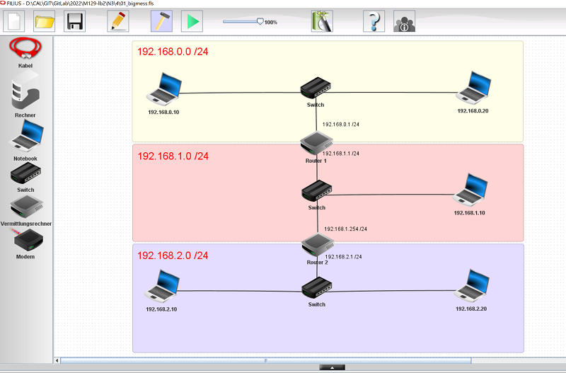
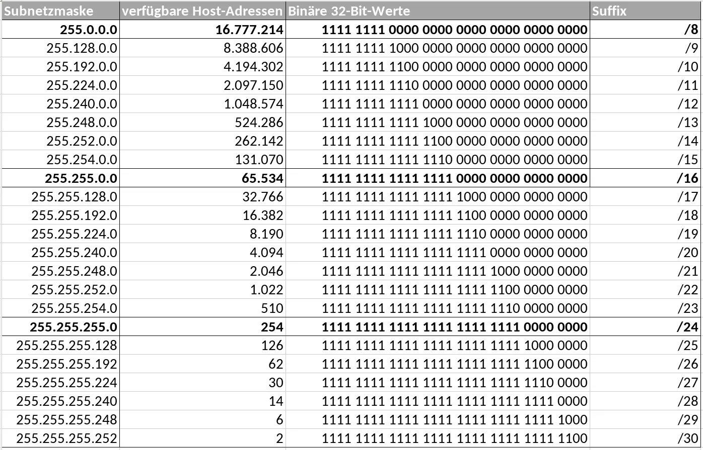

# Fehlersuche im Netzwerk (mit Filius)

## Aufgabenstellung 3.3

## Situation

Drei Subnetze im /24er Bereich werden mit zwei Routern getrennt. Leider funktioniert es nicht so wie es sollte.

Das Netzwerklayout sieht wie folgt aus

### Auftrag

-   Sie gehen strukturiert vor, um die **Fehler zu finden** und zu
    **korrigieren**.
-   Ihre ausgeführten Schritte für die **Fehlersuche** halten Sie in Ihrer **Dokumentation** fest.
-   Zusätzlich halten Sie die **gefundenen Fehler und deren Behebung** in der separaten Tabelle fest.
- Nachdem Sie alles korrekt konfiguriert und erfolgreich getestet haben, zegen Sie Ihre finale Version dem Coach/Lehrer (Live-Demo).

### Fehlersuche Journal

| **Ausgeführter Test** | **Beobachtetes Resultat und Ausgeführte Korrektur** |
|------------|----------|
| Konfiguration von Laptop 192.168.0.10 angeschaut | Netzmaske 255.0.0.0 , geändert auf 255.255.255.0  |
| Konfiguration von Laptop 192.168.0.10 angeschaut | Gateway leer, geändert auf 192.168.0.1  |
| Konfiguration von Laptop 192.168.0.20 angeschaut | Netzmaske 255.255.0.0 , geändert auf 255.255.255.0  |
| Konfiguration von Laptop 192.168.0.20 angeschaut | Gateway leer , geändert auf 192.168.0.1 |
| Konfiguration von Router 1 angeschaut | Gateway leer, geändert auf 192.168.1.254 |
| Konfiguration von Router 1 angeschaut | Verbindung zu Switch in 192.168.0.1 ist 0.0.0.0 mit Netzmaske 255.0.0.0, IP auf 192.168.0.1 gesetzt Netzmaske auf 255.255.255.0|    
| Konfiguration von Router 1 angeschaut | Verbindung zu Switch in 192.168.1.1 ist 0.0.0.0 mit Netzmaske 255.255.0.0, IP auf 192.168.1.1 gesetzt Netzmaske auf 255.255.255.0|  
| Konfiguration von Laptop 192.168.1.10 angeschaut | Gateway leer , geändert auf 192.126.1.1  |
| Konfiguration von Router 2 angeschaut | Anschluss 1.1.1.1 geändert auf 192.168.1.254  |
| Konfiguration von Router 2 angeschaut | Anschluss 192.168.0.0 geändert auf 192.168.2.1  |
| Konfiguration von Router 2 angeschaut | Subnetzmaske von anschluss 192.168.2.1 auf 255.255.255.0 geändert |
| Konfiguration von Router 2 angeschaut | Gateway leer, geändert auf 192.168.1.1 |
| Konfiguration von Laptop 192.168.2.10 angeschaut | Subnetzmaske von 255.255.0.0 auf 255.255.255.0 geändert   |  
| Konfiguration von Laptop 192.168.2.10 angeschaut | Gateway leer, auf 192.168.2.1 geändert |
| Konfiguration von Laptop 192.168.2.20 angeschaut | Gateway leer, auf 192.168.2.1 geändert |
| Konfiguration von Laptop 192.168.2.10 angeschaut | Subnetzmaske von 255.0.0.0 auf 255.255.255.0 geändert |
| Diverse Pings| Netzwerk funktioniert|

### Quellen/Resourcen

Subnetztabelle
 [**ScaleUpTech**](https://www.google.com/url?sa=i&url=https%3A%2F%2Fwww.scaleuptech.com%2Fblog%2Fwas-ist-und-wie-funktioniert-subnetting%2F&psig=AOvVaw2Kq-971-D4MhHarboRuGbM&ust=1705600037034000&source=images&cd=vfe&opi=89978449&ved=0CBQQjhxqFwoTCIi2qrT95IMDFQAAAAAdAAAAABAD)

Fragen und Antworten
[**ChatGPT**](https://chat.openai.com)

 

