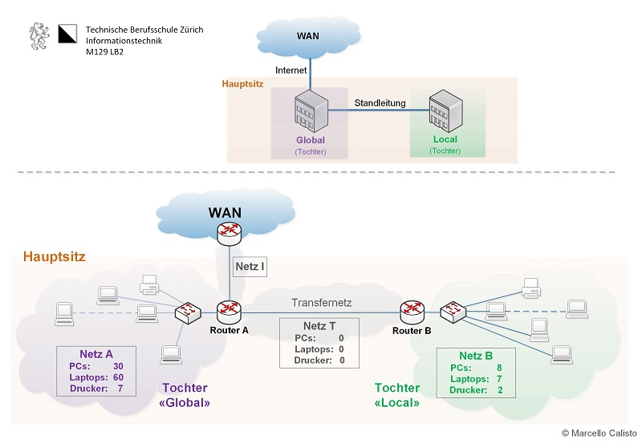
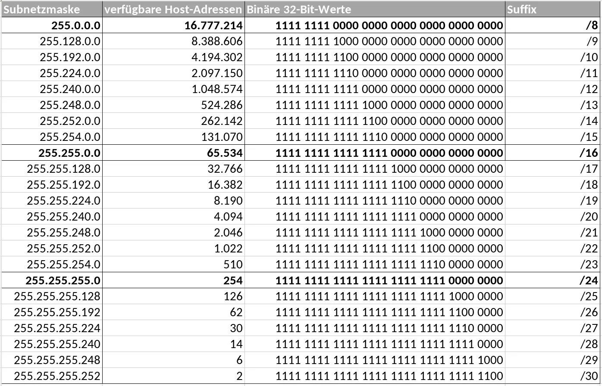

# Subnetting und Routing mit unterschiedlich grossen Netzwerken im letzten Oktett

## Aufgabenstellung 3.4

**Theorie und Praxis kombiniert**

Zuerst erstellen Sie das Netzwerk-Design. Danach setzen Sie die Umgebung mit CISCO Packet Tracer um (Vorlage weiter unten)

## Ausgangslage
Die **IT-Grow Holding** hat ihren **Hauptsitz** in Glattbrugg (Management und Verwaltung). Sie verwaltet zwei Tochterunternehmen. Die Tochter **Global** ist im gleichen Gebäude untergebracht, wie das Management. Die Tochter **Local** ist auf der anderen Strassenseite einquartiert. 

| Produkt:   | Site **Global** | Site **Local** | 
|:-----------|:---------------:|:--------------:|
| PCs        | 30              | 8              | 
| Laptops    | 60              | 7              |
| Drucker    | 7               | 2              |
| **Total**  | **97**          | **17**         |

Die beiden Teilfirmen sind über eine Standleitung miteinander verbunden. Die **beiden Häuser haben getrennte Netze**. Der Hauptsitz ist über einen **DSL-Router mit dem Internet** verbunden. Die IT-Verwaltung wird intern geführt. Sie sind verantworlich für das Netzwerkmanagement der gesamten Holding.

### Vorgaben:

Folgende Bedingungen sind vorgegeben und **müssen** eingehalten werden:

- Vom ISP erhalten sie den IP-Range: **178.19.22.0 /24**
- Erstellen Sie **unterschiedlich grosse Subnetze** - für jede Abteilung eines, plus noch die **Transfernetze**.

**Situations- und Netzwerkplan**

## 1. Teilauftrag (Theorie)

Erstellen Sie für die **IT-Grow Holding** einen IP-Plan mit folgenden Teil-Aufgaben. Bei jeder Tabelle unten ist **die erste Zeile** als Beispiel ausgefüllt. Wenn sie [**DIESE Excel-Tabelle**](P3_4_Netzwerk-Einteilung.xlsx) vorher korrekt ausfüllen, fällt es Ihnen einfacher. Und; Sie haben eine hervorragende Hilfe bei der späteren Umsetzung.  

1.  Teilen Sie das erhaltene Netz in passende **Subnetze** auf.
2.  Bestimmen Sie die **Netzadressen**, **Netzmasken** und **Broadcastadressen**.
3.  Teilen Sie den **Routerinterfaces IP-Adressen** zu.
4.  Erstellen Sie die **Routingtabellen** für **Router Haus A** und **Router
    Haus B**.

### Netzgrössen

| Netz | Benötigte Adressen | Gewählte Netzgrösse |
|--------|-----------------------------------------|--------------|
| Netz I | 0 PCs + 0 LTs + 0 DR + 2 RT + 2 = 4     |    2 = /30   |
| Netz T | 0 PCs + 0 LTs + 0 DR + 2 RT + 2 = 4     |    2 = /30   |
| Netz A | 30 PCs + 60 LTs + 7 DR + 1 RT + 2 = 100 |    126 = /25 |
| Netz B | 8 PCs + 7 LTs + 2 DR + 1 RT + 2 = 20   |    30 = /27  |

### Netzadressen

| Netz   | Grösse | Netzadresse/Netzmaske (Bit) | Dezimale Schreibweise der Netzmaske | Broadcastadresse |
|--------|-----|-----|-----|-----|
| Netz I |  4  | 178.19.22.88 /30  | 255.255.255.252 | 178.19.22.91 |
| Netz T | 4 | 178.19.22.92 /30 | 255.255.255.252 | 178.19.22.95 |
| Netz A | 100 | 178.19.22.128 /25 | 255.255.255.128 | 178.19.22.255 |
| Netz B | 20 | 178.19.22.96 /27 | 255.255.255.224 | 178.19.22.127 |

---

### Grafische Darstellung (Kreis)

---

 

### Router-Interfaces

| **Router**      | **Interfaceadresse** | **Interface** |
|-----------------|----------------------|---------------|
| Router A Netz I | 178.19.22.89 /30     | s1            |
| Router A Netz A | 178.19.22.129 /25    | e0            |
| Router A Netz T | 178.19.22.93 /30     | s0            |
| Router B Netz B | 178.19.22.97 /27     | e0            |
| Router B Netz T | 178.19.22.94 /30     | s0            |

### Routingtabelle Router A

| **Destination Network** (Zielnetz + Netzmaske) | **Next Hop** (Nächster Router auf dem Weg zum Ziel) | **Metric** (hier Hop Count)  | **Interface** (auf diesem Router) |
|-----|------|----------|------|
| (A) 178.19.22.128 /25   | -- | 0 | e0 |
| (T)          | -- | 0 | s0 |
| (I) AUSFÜLLEN         | -- | 0 | s1 |
| (B) AUSFÜLLEN         | AUSFÜLLEN | 1 | s0 |
| (Default) 0.0.0.0 / 0 | 178.19.22.193 /30 | -- | s1 |

### Routingtabelle Router B

| **Destination Network**  (Zielnetz + Netzmaske) | **Next Hop** (Nächster Router auf dem Weg zum Ziel) | **Metric** (hier Hop Count)  | **Interface** (auf diesem Router) |
|--------|-------|-------|---------|
| (T) AUSFÜLLEN  | -- | 0 | s0 |
| (B) AUSFÜLLEN  | -- | 0 | e0 |
| (Default) 0.0.0.0 / 0 | AUSFÜLLEN | -- | s0 |

## 2. Teilauftrag (Praxis)
Setzen Sie diese Netzwerkumgebung mit dem CISCO Packet Tracer um. Nutzen Sie dabei DIESE VORLAGE. Sie müssen **keine** weiteren Geräte anschliessend. Die Namen der Geräte sind bereits eingetragen. Sämtliche Konfigurationen fehlen noch. Achten Sie ausserdem darauf, dass diverse Netzwerkkarten noch eingeschaltet werden müssen, damit sie überhaupt funktionieren.
- [CISCO Packet Tracer Vorlage](Vorlage.pkt)

## Abgabe:
- Dokumentation mit allen Angaben zum Netzwerk
- Live-Demo bei der LP - Doku und CISCO PT (10’)

## Ressourcen:
- [Lösungen zu einer ählichen Aufgabe, die im Unterricht durchgeführt wurde](../5/P3_5_uebung_a.pdf)
- [Tutorial "Routing Teil 2 (Statisches Routing)](https://web.microsoftstream.com/video/0d47cf40-6a8a-4539-a7b4-b0cfeeac51ce?list=studio) (Statisches Routing auf CISCO Packet Tracer erklärt) - 8:55

### Quellen/Eigene Resourcen

Subnetztabelle
 [**ScaleUpTech**](https://www.google.com/url?sa=i&url=https%3A%2F%2Fwww.scaleuptech.com%2Fblog%2Fwas-ist-und-wie-funktioniert-subnetting%2F&psig=AOvVaw2Kq-971-D4MhHarboRuGbM&ust=1705600037034000&source=images&cd=vfe&opi=89978449&ved=0CBQQjhxqFwoTCIi2qrT95IMDFQAAAAAdAAAAABAD)

Fragen und Antworten
[**ChatGPT**](https://chat.openai.com)

 

 
