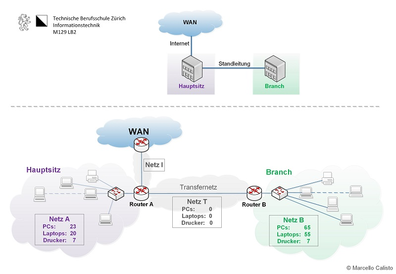
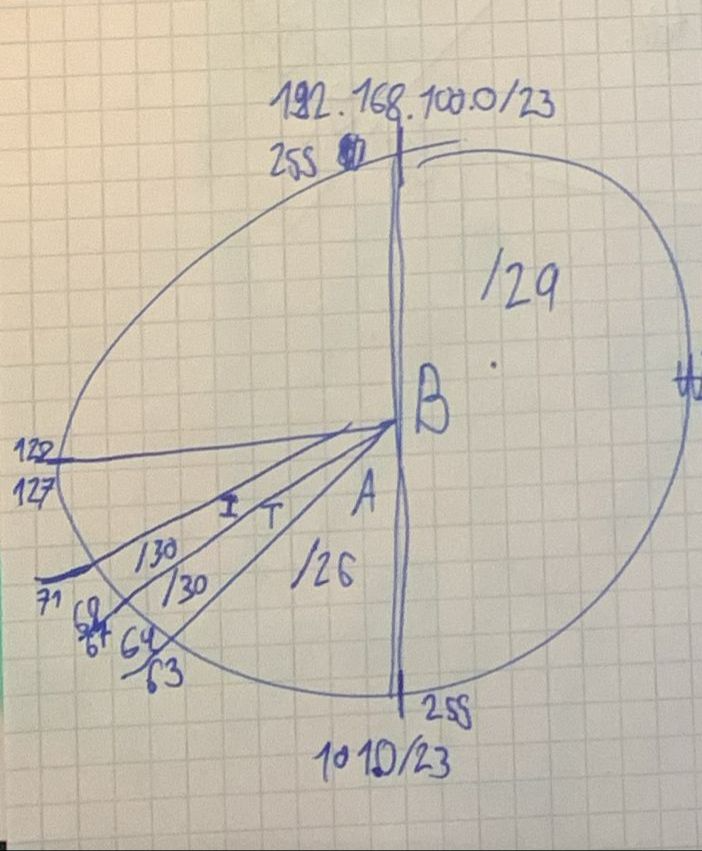
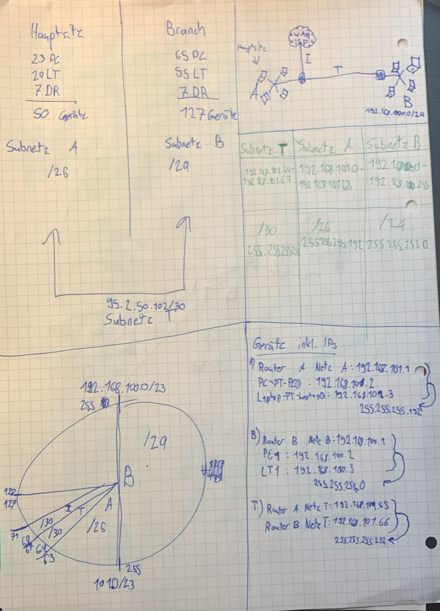

# Subnetting und Routing mit unterschiedlich grossen Netzwerken über zwei Oktette

## Aufgabenstellung 3.5

**Theorie und Praxis kombiniert**

Zuerst erstellen Sie das Netzwerk-Design. Danach setzen Sie die Umgebung mit CISCO Packet Tracer um (Vorlage weiter unten)

## Ausgangslage
Die Firma Go-IT AG hat einen **Hauptsitz** im Zentrum von Zürich (Management und Verwaltung) und einen **Branch** in einem Aussenquartier (Betrieb).

**Hauptsitz:**  
- 23 PCs
- 20 Laptops  
- 7 Drucker

**Branch:**  
- 65 PCs
- 55 Laptops  
-  7 Drucker

Beide Firmensitze sind über eine Standleitung verbunden. Die **beiden Häuser haben getrennte Netze**. Der Hauptsitz ist über einen **DSL-Router mit dem Internet** verbunden.

Für die Netzwerke steht das **Netz 192.168.100.0/23**
zur Verfügung. Für die Internetleitung erhalten wir vom ISP die statische IP-Adresse **95.2.50.102/30**, der Router des ISP hat die IP-Adresse **95.2.50.101/30**.

**Situations- und Netzwerkplan**

## 1. Teilauftrag (Theorie)

Erstellen Sie für die Firma **Go-IT** einen IP-Plan mit folgenden Teil-Aufgaben. Bei jeder Tabelle ist **die erste Zeile** als Beispiel ausgefüllt.

1.  Teilen Sie das erhaltene Netz in passende **Subnetze** auf.

2.  Bestimmen Sie die **Netzadressen**, **Netzmasken** und **Broadcastadressen**.

3.  Teilen Sie den **Routerinterfaces IP-Adressen** zu.

4.  Erstellen Sie die **Routingtabellen** für **Router Haus A** und **Router
    Haus B**.

### Netzgrössen

| Netz | Benötigte Adressen | Gewählte  Netzgrösse |
|------|-----------|----------------|
| Netz T | 2  |    4  |
| Netz I | vom Provider | -
| Netz A | 50 | 64 |
| Netz B | 127 | 255 |

### Netzadressen

| Netz   | Grösse | Netzadresse/Netzmaske (Bit) | Dezimale Schreibweise der Netzmaske | Broadcastadresse |
|--------|-----|-----|-----|-----|
| Netz I |  4  | 92.2.50.100 /30  | 255.255.255.252 | 92.2.50.103 |
| Netz T | 4 | 192.168.101.64 /30 | 255.255.255.252 | 192.168.101.67 |
| Netz A | 64 | 192.168.101.0 /26  | 255.255.255.192 | 192.168.101.63 |
| Netz B | 128 | 192.168.100.0 /24 | 255.255.255.0 | 192.168.100.255 |

---

### Grafische Darstellung (Kreis)

---

 

### Router-Interfaces

| **Router**      | **Interfaceadresse** | **Interface** |
|-----------------|----------------------|---------------|
| Router A Netz I | 95.2.50.102 /30      | fe2            |
| Router A Netz A | 192.168.101.1 /26    | fe0            |
| Router A Netz T | 192.168.101.65 /30   | fe1            |
| Router B Netz B | 192.168.100.1 /24    | fe0            |
| Router B Netz T | 192.168.101.66 /30   | fe1            |

### Routingtabelle Router A

| **Destination Network** (Zielnetz + Netzmaske) | **Next Hop** (Nächster Router auf dem Weg zum Ziel) | **Metric** (hier Hop Count)  | **Interface** (auf diesem Router) |
|-----|------|----------|------|
| (A) 192.168.101.0 /26   | -- | 0 | fe0 |
| (T) 192.168.101.64 /30 | -- | 0 | fe1 |
| (I) 95.2.50.100 /30 | -- | 0 | fe2 |
| (B) 192.168.100.1 /24| 192.168.101.66 | 1 | fe1 |
| (Default) 0.0.0.0 / 0 | 95.2.50.101/30 | -- | fe2 |

### Routingtabelle Router B

| **Destination Network**  (Zielnetz + Netzmaske) | **Next Hop** (Nächster Router auf dem Weg zum Ziel) | **Metric** (hier Hop Count)  | **Interface** (auf diesem Router) |
|--------|-------|-------|---------|
| (T) 192.168.101.64 /30  | -- | 0 | fe1 |
| (B) 192.168.100.0 /24  | -- | 0 | fe0 |
| (Default) 0.0.0.0 / 0 | 192.168.101.65 /30 | 1 | fe1 |

## Abgabe:
- Dokumentation mit allen Angaben zum Netzwerk
- Live-Demo bei der LP - Doku und CISCO PT (10’)

## Ressourcen:
- [Lösungen zu einer ählichen Aufgabe, die im Unterricht durchgeführt wurde](P3_5_uebung_a.pdf)
- [Tutorial "Routing Teil 2 (Statisches Routing)](https://web.microsoftstream.com/video/0d47cf40-6a8a-4539-a7b4-b0cfeeac51ce?list=studio) (Statisches Routing auf CISCO Packet Tracer erklärt) - 8:55

### Eigene Quellen und Resourcen

](../3/image-1.png)

Subnetztabelle
 [**ScaleUpTech**](https://www.google.com/url?sa=i&url=https%3A%2F%2Fwww.scaleuptech.com%2Fblog%2Fwas-ist-und-wie-funktioniert-subnetting%2F&psig=AOvVaw2Kq-971-D4MhHarboRuGbM&ust=1705600037034000&source=images&cd=vfe&opi=89978449&ved=0CBQQjhxqFwoTCIi2qrT95IMDFQAAAAAdAAAAABAD)

Fragen und Antworten
[**ChatGPT**](https://chat.openai.com)

### Notizen

 

